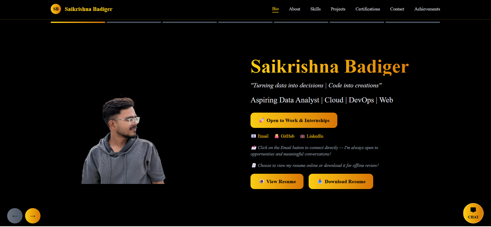
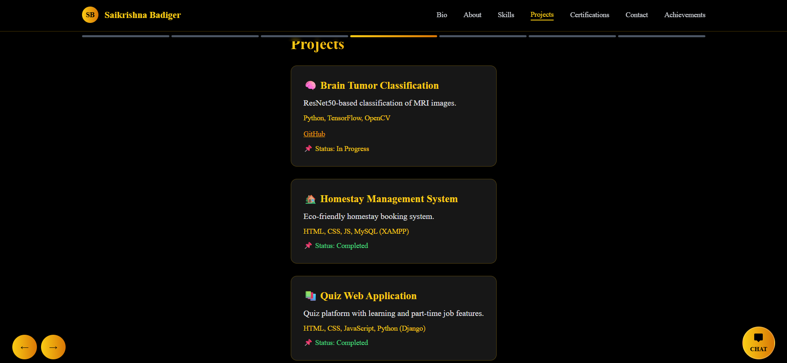
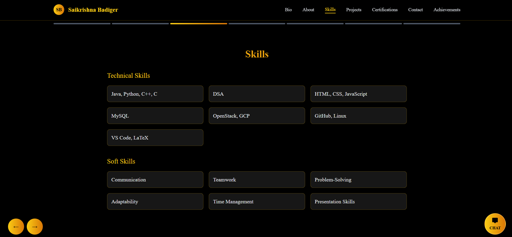
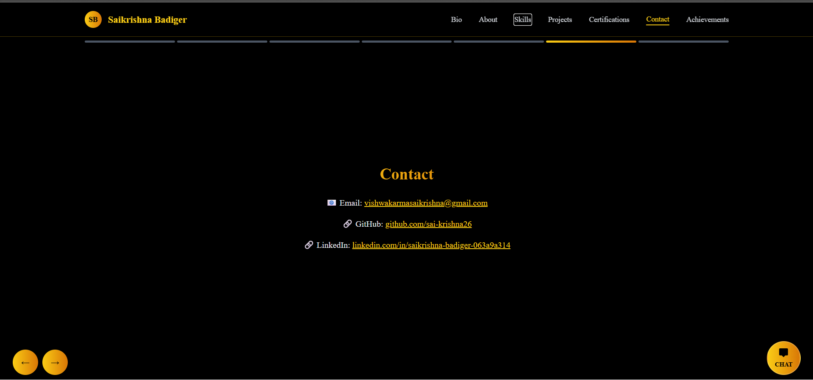

# Saikrishna Badiger | Portfolio

Welcome to my personal portfolio! This repository hosts my **React-based portfolio website**, showcasing my projects, skills, and achievements.  

Live site: [https://sai-krishna26.github.io/saikrishna-portfolio-styled](https://sai-krishna26.github.io/saikrishna-portfolio-styled)

---

## Portfolio Preview






---

## About Me

Hi! I’m **Saikrishna Badiger**, a Computer Science student from Adichunchanagiri Institute of Technology (2022–2026).  
I am passionate about **software development, data analysis**, and building interactive web applications.  

---

## Features

- Modern, responsive design built with **React** and **TailwindCSS**  
- Showcases projects with screenshots and live links  
- Contact section with email and social links  
- Resume download button  
- Animated charts and skill progress indicators  
- Dark/Light mode toggle  

---

## Technologies Used

- **Frontend:** React, TailwindCSS, HTML, CSS, JavaScript  
- **Build & Deployment:** GitHub Pages, npm, Git subtree method  
- **Version Control:** Git & GitHub  

---

## Deployment

The portfolio is deployed using **Git subtree** (recommended on Windows to avoid long path errors):

```bash
npm run build
git add .
git commit -m "Update portfolio"
git push origin main
git subtree push --prefix build origin gh-pages


---

## Deployment

The portfolio is deployed using **Git subtree** (recommended on Windows to avoid long path errors):

```bash
npm run build
git add .
git commit -m "Update portfolio"
git push origin main
git subtree push --prefix build origin gh-pages

## Contact

Email: vishwakarmasaikrishna@gmail.com

GitHub: https://github.com/sai-krishna26

LinkedIn: https://linkedin.com/in/saikrishna-badiger-063a9a314

## License

This project is licensed under the MIT License.


---
